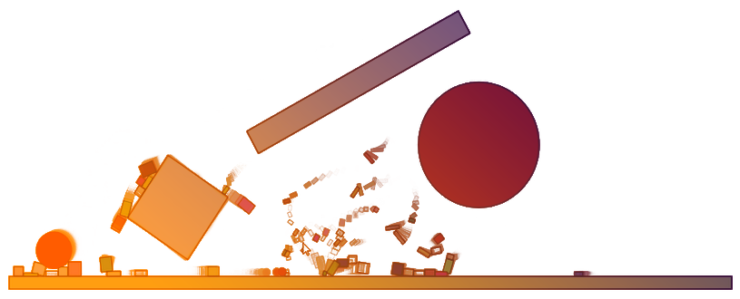

Translation：[English](./README.md)

## ExperDot.EDGameEngine
适用于 UWP 的 2D 游戏图形引擎- 2D Game Graphics Engine For Universal Windows Platform

## 最新更新 
- 接近真实的 2D 世界，已加入 FarsserPhysics 引擎！

## 引擎功能
您可以通过 C# 或 VB.NET 轻松使用它！
- 使用 Win2D 渲染图形
- 播放音乐和音效
- 处理键盘和鼠标输入
- 支持场景内嵌 Xaml 控件
- 提供平台跳跃游戏引擎
- 提供 FarsserPhysics 物理引擎，支持2D物理仿真

## 游戏模型
核心库或模型库为您提供丰富的的游戏模型

##### 几何图元
- 线段、矩形、圆
- 不规则多边形

##### 粒子系统
- [粒子集群](Documentation/Images/ParticleSystem/Sample_ParticleSystem_01.png)
- [水花飞溅](Documentation/Images/ParticleSystem/Sample_ParticleSystem_02.png)
- [光芒四射](Documentation/Images/ParticleSystem/Sample_ParticleSystem_03.png)
- [枝繁叶茂](Documentation/Images/ParticleSystem/Sample_ParticleSystem_04.png)

##### 分形
- [朱利亚集](Documentation/Images/Fractal/Sample_Fractal_03.png)
- [曼德布罗集](Documentation/Images/Fractal/Sample_Fractal_01.png)
- [迭代函数系统：树木](Documentation/Images/Fractal/Sample_Fractal_02.png)

##### 自然树
- [树枝/花朵贴图](Documentation/Images/NatureTree/Sample_NatureTree_01.png)
- [植物生长](Documentation/Images/NatureTree/Dynamic/Dynamic_NatureTree_02.gif)
- [植物摇曳](Documentation/Images/NatureTree/Dynamic/Dynamic_NatureTree_01.gif)

##### 自动机
- [生命游戏](Documentation/Images/Automata/Sample_CelluarAutomata_01.png)
- [水墨侵染](Documentation/Images/Automata/Sample_CelluarAutomata_02.png)

##### 自动绘图
- 全自动绘制图形（WinForm 版本，[点击查看](https://github.com/experdot/ExperDot.AutomaticDrawing)）

##### 自动拼图
- 全自动拼接图像(暂不可用）

*上述部分可视化模型仍在测试阶段，随后会有较大的改动

## 联系方式
* 邮件：experdot@foxmail.com
* 博客园: [@ExperDot](http://www.cnblogs.com/experdot/)
