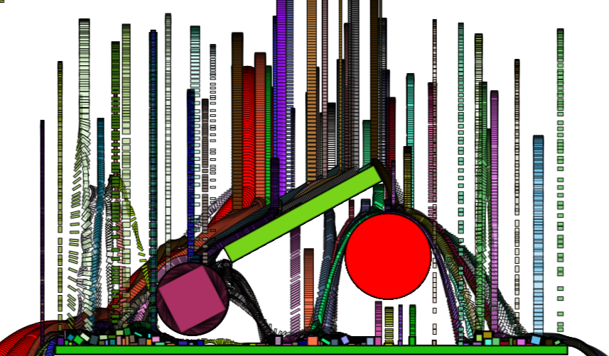

Translation:[Simple-Chinese](./README.md)(简体中文)

# What's EDGameEngine?
2D Game Graphics Engine For Universal Windows Platform

## Newest activity 
- Realistic 2D world. Now engine has joined the FarsserPhysics!

## Game Model
Library provides you with a wealth of game models.

##### Geometry
- Line、Rectangle、Cicle
- Polygon（Disabled）

##### PaticalSystem
- [Particle cluster](Documentation/Image/ParticalSystem/Sample_ParticalSystem_01.png)
- [Splish splash](Documentation/Image/ParticalSystem/Sample_ParticalSystem_02.png)
- [Brilliant light](Documentation/Image/ParticalSystem/Sample_ParticalSystem_03.png)

##### Fractal
- [GastonJulia](Documentation/Image/Fractal/Sample_Fractal_03.png)
- [Mandelbrot](Documentation/Image/Fractal/Sample_Fractal_01.png)
- [IFS：Tree](Documentation/Image/Fractal/Sample_Fractal_02.png)

##### Nature-Tree
- [Sprite](Documentation/Image/NatureTree/Sample_NatureTree_01.png)
- [Grow up](Documentation/Image/NatureTree/Dynamic/Dynamic_NatureTree_02.gif)
- [Sway](Documentation/Image/NatureTree/Dynamic/Dynamic_NatureTree_01.gif)

##### Automata
- [Game of life](Documentation/Image/Automata/Sample_CelluarAutomata_01.png)
- [Ink infection](Documentation/Image/Automata/Sample_CelluarAutomata_02.png)

##### AutoDraw
- Painting automaticlly
##### AutoStitch
- Stitching automaticlly(Disabled）

*A few of models are still in the testing phase,then there will be major changes.
## Feedback
* Email：experdot@foxmail.com
* Blog: [@ExperDot](http://www.cnblogs.com/experdot/)
